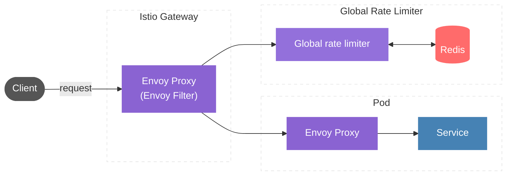
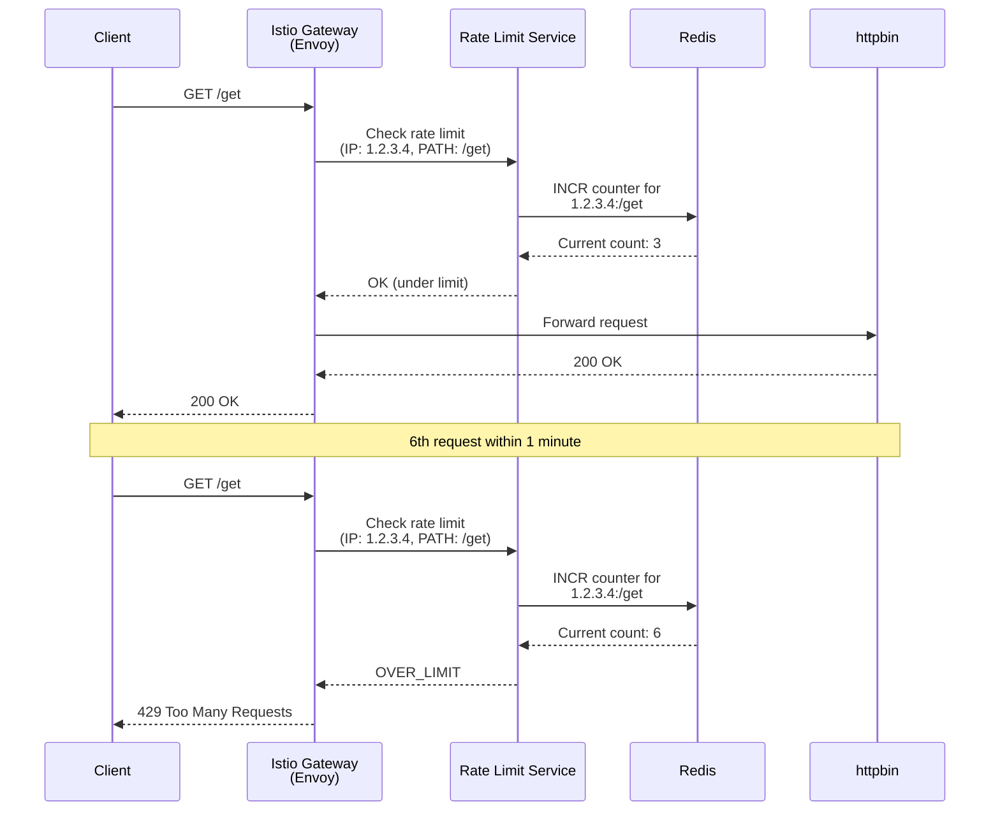
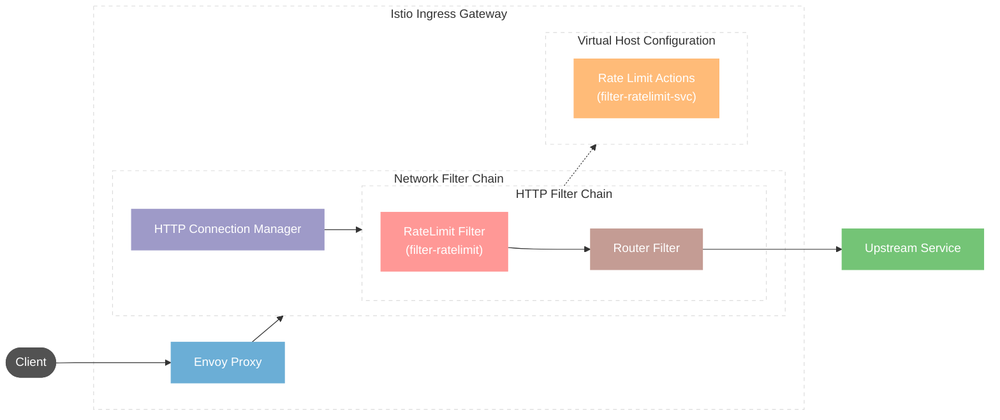

You don’t need a malicious attacker to take down your services.
A bug in a single internal client, a misconfigured CronJob, or an over-eager retry policy can generate enough traffic to overload your mesh.

In this post, we’ll build a global rate limiting setup in Istio using Envoy Filters + a Redis-backed rate limit service. By the end, you’ll have:

- A working global rate limiter on your ingress gateway
- Configurable path-based limits
- A mental model of how Envoy’s HTTP filter chain and the rate limit service fit together

## What is Rate Limiting?

Rate limiting is a mechanism to prevent services from being overwhelmed with requests. Think of it as traffic shaping for your APIs — it controls how many requests a client can make within a time window.

## Why Rate Limiting is Critical? (The Stakes)

Without rate limiting, you're vulnerable to:

**Accidental DDoS attacks**: A buggy client with an infinite retry loop can generate more traffic than a malicious actor. I've seen a single misconfigured Kubernetes CronJob bring down a production cluster serving millions of users.

**Cascading failures**: When one service gets overwhelmed, it starts timing out. Those timeouts trigger retries. Retries create more load. More load causes more timeouts. Before you know it, your entire service mesh is in a death spiral—and your on-call engineer is having a very bad day.

**Resource exhaustion**: That expensive AI inference endpoint you're running? Without rate limits, a single user can rack up your cloud bill by thousands of dollars in minutes.

**The noisy neighbor problem**: In a multi-tenant environment, one customer's traffic spike shouldn't degrade service for everyone else. But without rate limiting, that's exactly what happens.


## The Solution Landscape (Setting up your specific approach)

Rate limiting can be implemented at multiple layers of your stack:

- **CDN/Edge layer** (Cloudflare, AWS WAF): Great for public APIs, but doesn't help with internal service-to-service traffic
- **API Gateway** (Kong, Tyk): Effective, but creates a single point of failure and doesn't integrate with your service mesh
- **Application layer** (custom code): Maximum flexibility, maximum maintenance burden—and every team implements it differently
- **Service mesh layer** (Istio/Envoy): The sweet spot for microservices architectures

## Rate limits

Envoy supports two kinds of rate limiting: **local and global.** 
- **Local rate limiting** is used to limit the rate of requests per service instance.
- **Global rate limiting** uses a global gRPC rate limiting service to provide rate limiting for the entire mesh. Local rate limiting can be used in conjunction with global rate limiting to reduce load on the global rate limiting service.
 

### Istio Local vs Global Rate Limiting : which one should you choose?

<div style="display: flex; justify-content: center;" markdown="1">

|  | Local | Global |
|---------|-------|--------|
| Reduce load per pod/proxy | ✅ | ❌ |
| Cheaper & reliable | ✅ | ❌ |
| Rate limiting based on client IP | ❌ | ✅ |
| Rate limiting on wildcard basis | ❌ | ✅ |
| Easier path or header-based rate limiting | ❌ | ✅ |

</div>

Today, we're diving deep into **Istio's global rate limiting with Envoy Filters**—a solution that gives you centralized control, consistent enforcement across your mesh, and the flexibility to rate limit based on any request attribute you can imagine.

## Global Rate Limiter Architecture



### what is istio Envoy filter? 
- Swiss army knife of customizing Istio proxy (envoy) configuration
- For when the native Istio CRDs (VirtualService, DestinationRules) do not provide enough control over envoy configuration.
- Under the hood, Istio generates Envoy configs for you. An EnvoyFilter is a way to patch those generated configs, so you can:

    - Insert new HTTP filters (like the global rate limit filter)
    - Modify routes, clusters, listeners, etc. without abandoning the rest of Istio’s abstractions.

## Prerequisites
- Setup Istio in a Kubernetes cluster by following the instructions in the <a href="https://istio.io/latest/docs/setup/getting-started/" target="_blank">Installation Guide</a>.
- Deploy the <a href="https://github.com/istio/istio/blob/master/samples/httpbin/httpbin.yaml" target="_blank">HTTPBin sample application</a> to test rate limiting.
- Create istio gateway and virtualservice to route traffic to httpbin service

```yaml
apiVersion: networking.istio.io/v1alpha3
kind: Gateway
metadata:
  name: gateway
  namespace: istio-system
spec:
  selector:
    istio: ingressgateway
  servers:
  - port:
      number: 80
      name: http
      protocol: HTTP
    hosts:
    - "*"
---
apiVersion: networking.istio.io/v1alpha3
kind: VirtualService
metadata:
  name: httpbin
  namespace: istio-system
spec:
  hosts:
  - "*"
  gateways:
  - gateway
  http:
  - route:
    - destination:
        port:
          number: 8000
        host: httpbin.default.svc.cluster.local
```

## Implementing Global Rate Limiting

**Step 1: Configure the Rate Limit Rules**

Use the following configmap to configure the reference implementation to rate limit requests to the path `/get` at 5 req/min/ip and `/` at 3 req/min/ip. Its a prerequisite to have configmap for the global ratelimiting service deployment.

```yaml
apiVersion: v1
kind: ConfigMap
metadata:
  name: ratelimit-config
data:
  config.yaml: |
    domain: ratelimit
    descriptors:
      - key: remote_address
        descriptors:
        - key: PATH
          value: "/get"
          rate_limit:
            unit: minute
            requests_per_unit: 5
        - key: PATH
          value: "/"
          rate_limit:
            unit: minute
            requests_per_unit: 3
```
**Step 2: Deploy the Global Rate Limit Service**

Create a global rate limit service which implements Envoy’s rate limit service protocol. As a reference, a demo configuration can be found <a href="https://github.com/istio/istio/blob/release-1.28/samples/ratelimit/rate-limit-service.yaml" target="_blank"> here </a>, which is based on a reference implementation provided by Envoy.


```sh
curl -O https://raw.githubusercontent.com/istio/istio/refs/heads/release-1.28/samples/ratelimit/rate-limit-service.yaml
kubectl apply -f rate-limit-service.yaml
```
**Step 3: Apply the Envoy Filter**

Apply an EnvoyFilter to the ingressgateway to enable global rate limiting using Envoy’s global rate limit filter.

The patch inserts the `envoy.filters.http.ratelimit` global envoy filter into the `HTTP_FILTER` chain. The rate_limit_service field specifies the external rate limit service, `outbound|8081||ratelimit.default.svc.cluster.local` in this case.

```yaml
apiVersion: networking.istio.io/v1alpha3
kind: EnvoyFilter
metadata:
  name: filter-ratelimit
  namespace: istio-system
spec:
  workloadSelector:
    # select by label in the same namespace
    labels:
      istio: ingressgateway
  configPatches:
    # The Envoy config you want to modify
    - applyTo: HTTP_FILTER
      match:
        context: GATEWAY
        listener:
          filterChain:
            filter:
              name: "envoy.filters.network.http_connection_manager"
              subFilter:
                name: "envoy.filters.http.router"
      patch:
        operation: INSERT_BEFORE
        # Adds the Envoy Rate Limit Filter in HTTP filter chain.
        value:
          name: envoy.filters.http.ratelimit
          typed_config:
            "@type": type.googleapis.com/envoy.extensions.filters.http.ratelimit.v3.RateLimit
            # domain can be anything! Match it to the ratelimter service config
            domain: ratelimit
            failure_mode_deny: true
            timeout: 10s
            rate_limit_service:
              grpc_service:
                envoy_grpc:
                  cluster_name: outbound|8081||ratelimit.default.svc.cluster.local
                  authority: ratelimit.default.svc.cluster.local
              transport_api_version: V3
```

Apply another EnvoyFilter to the ingressgateway that defines the route configuration on which to rate limit. This adds rate limit actions for any route from a virtual host. The descriptor key is PATH and the value is the request path. This will match the descriptors defined in the rate limit service configmap.

```yaml
apiVersion: networking.istio.io/v1alpha3
kind: EnvoyFilter
metadata:
  name: filter-ratelimit-svc
  namespace: istio-system
spec:
  workloadSelector:
    labels:
      istio: ingressgateway
  configPatches:
    - applyTo: VIRTUAL_HOST
      match:
        context: GATEWAY
        routeConfiguration:
          vhost:
            name: ""
            route:
              action: ANY
      patch:
        operation: MERGE
        # Applies the rate limit rules.
        value:
          rate_limits:
            - actions:
              - remote_address: {}
              - request_headers:
                  header_name: ":path"
                  descriptor_key: "PATH"
```
### Testing Your Rate Limits

Let's verify everything works. Get your ingress gateway's external IP:

```bash
export GATEWAY_URL=$(kubectl get -n istio-system svc istio-ingressgateway -o jsonpath='{.status.loadBalancer.ingress[0].ip}')
```

Test the `/get` endpoint (limited to 5 requests/minute):

```bash
for i in {1..10}; do
  curl -s -o /dev/null -w "Request $i: %{http_code}\n" http://$GATEWAY_URL/get
  sleep 1
done
```

You should see the first 5 requests return `200 OK`, and subsequent requests return `429 Too Many Requests`.

Check the rate limiter logs to see it in action:

```bash
kubectl logs -n istio-system -l app=ratelimit -f
```
### How a Rate-Limited Request Flows



### Understanding Envoy Filter Chain



## Common Pitfalls (Learn from My Mistakes)

**Pitfall #1: Forgetting the ConfigMap**
The rate limit service won't start without the ConfigMap mounted. Always apply the ConfigMap before deploying the service.

**Pitfall #2: Wrong workload selector**
If your EnvoyFilter uses `name: gateway` but your ingress gateway has label `istio: ingressgateway`, the filter won't apply. Verify labels with:
`kubectl get pods -n istio-system --show-labels | grep ingressgateway`

**Pitfall #3: Domain mismatch**
The `domain` in your EnvoyFilter must exactly match the `domain` in your ConfigMap. A mismatch means no rate limiting happens (and no error messages).

**Pitfall #4: Descriptor order mismatch**
The descriptors in your EnvoyFilter's `rate_limits.actions` must match the descriptor hierarchy in your ConfigMap **in the exact same order**. 

For example, if your EnvoyFilter sends descriptors in order `[remote_address, PATH]`, your ConfigMap must have `remote_address` as the parent key with `PATH` nested inside. If the order doesn't match or keys are missing, the rate limit service won't find a matching rule and won't enforce limits. Always verify the descriptor chain matches between both configurations.

**Pitfall #5: Not monitoring the rate limiter**
The rate limit service is now a critical component. Monitor its availability and latency. If it goes down with `failure_mode_deny: true`, all traffic gets blocked.

In production, you may want to start with `failure_mode_deny: false` while you harden and monitor the rate limit service. That way, a failure in the rate limit service fails open (no rate limiting, but requests still flow) instead of closed (all traffic blocked).

## Performance Considerations

**Redis is your bottleneck**: Every request triggers a Redis query. For high-traffic scenarios:
- Use Redis Cluster for horizontal scaling
- Consider Redis persistence (RDB/AOF) to survive restarts
- Monitor Redis memory usage - rate limit counters accumulate

## Wrapping Up

We started with a simple goal: protect the entire mesh from bad or bursty traffic without rewriting every service.

You now have:

- A global rate limit service wired into the Istio ingress gateway via EnvoyFilters
- Path-based limits (`/get` vs `/`) enforced centrally
- A clear picture of how Envoy’s HTTP filter chain and rate limit descriptors work together

To turn this from “PoC” into “production”:

1. **Add observability**: Export rate limit metrics to Prometheus and create Grafana dashboards
2. **Implement dynamic limits**: Use Envoy's runtime configuration to adjust limits without redeploying
3. **Test failure scenarios**: What happens when Redis goes down? When the rate limit service is slow?
4. **Scale Redis appropriately**: Use Redis Cluster or a managed service and monitor CPU, memory, and key cardinality

## Related resources
- <a href="https://istio.io/latest/docs/tasks/policy-enforcement/rate-limit/#rate-limits" target="_blank">Istio Rate Limiting Documentation</a>
- <a href="https://istio.io/latest/docs/reference/config/networking/envoy-filter/" target="_blank">Istio Envoy Filter Documentation</a>
- <a href="https://www.envoyproxy.io/docs/envoy/latest/api-v3/extensions/filters/http/ratelimit/v3/rate_limit.proto#extensions-filters-http-ratelimit-v3-ratelimit" target="_blank">Envoy Rate Limit  Documentation</a>


---
<h3 style="text-align:center;"> Subscribe to Level Up </h3>

<div style="text-align: center;">
<iframe src="https://karthikeyangopi.substack.com/embed" width="480" height="250" frameborder="0" scrolling="no"></iframe>
</div>


